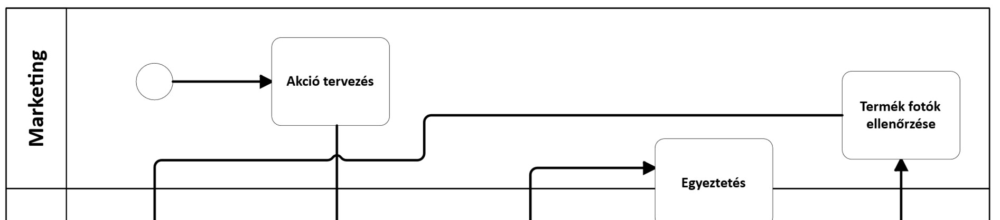
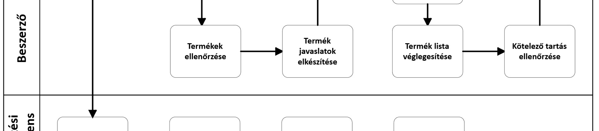
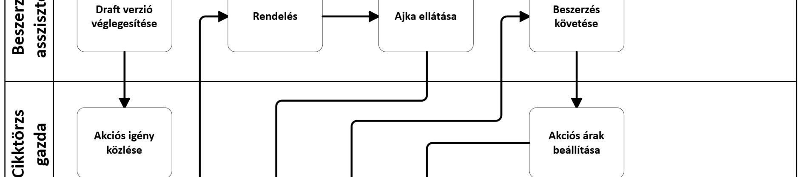
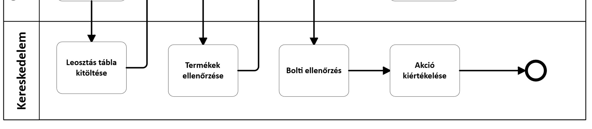
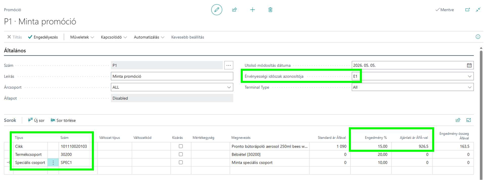
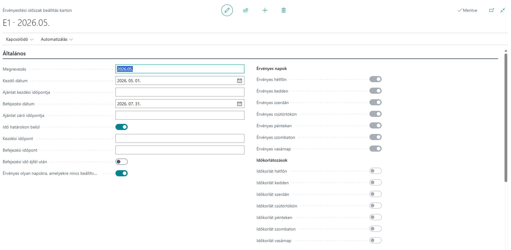
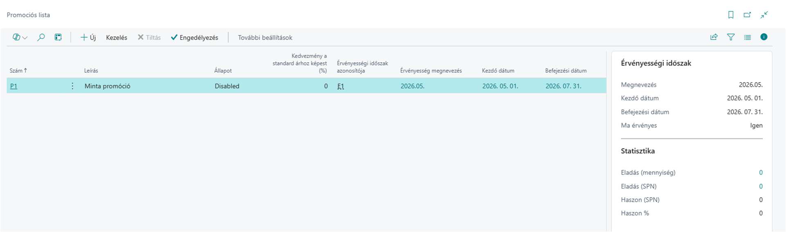

layout: page
title: "Promóció"
permalink: /promo
---

## Promóció

## Folyamatok leírása

*Promóciós koordináció * A promóciós koordináció folyamata akkor indul el, amikor a beszerzési terület egy vagy több terméket promócióba kíván helyezni, illetve amikor marketing- vagy kereskedelmi célból promóciós aktivitás tervezése válik szükségessé. A folyamat célja a különböző promóciós megjelenések és akciótípusok összehangolt megszervezése, az érintett szervezeti egységekkel együttműködésben, biztosítva a megfelelő promóciós árazást és a szükséges jóváhagyásokat.

A folyamat elején a promóciós koordináció a beszerzőkkel és a marketing osztállyal együttműködve tervezi meg a tervezett promóciós aktivitásokat. Ide tartozik többek között az akciós újság készítése és szerkesztése, az osztogatások szervezése, valamint az online megjelenések kezelése. Ezeknél a lépéseknél a marketing osztály tartalmi és megjelenési szempontból, míg a beszerzők termék- és ajánlati oldalról vesznek részt az előkészítésben.

A promóciós koordináció feladata továbbá a különböző vizuális és jóváhagyásra köteles promóciós anyagok kezelése. Ide tartoznak a wobblerek, plakátok, valamint egyéb, bolti vagy online felületeken megjelenő anyagok, amelyek előkészítése és menedzselése a marketing osztállyal együttműködésben történik. Ezzel párhuzamosan a folyamat kiterjed a kuponos promóciókra is, mint például a Glamour napok, Joy napok és egyéb hasonló akciók, amelyeknél a beszerzők és a cikktörzs kezelő kollégák bevonása is szükséges.

A folyamat része az LST-k kezelése, valamint az óriásplakátokon való megjelenések tervezése és szervezése. Ezekben az esetekben a promóciós koordináció a marketing osztállyal, a beszerzőkkel és - az érintett termékadatok miatt - a cikktörzs osztállyal működik együtt. Emellett a pontgyűjtő promóciók szervezése során a marketing osztály mellett a beszerzési vezető és a beszerző csapat is részt vesz a döntésekben és az előkészítésben.

A folyamat kiterjed az üzemeltetői promóciókra is, például kupon akciókra vagy night shopping eseményekre. Ezek szervezése a kereskedelmi osztállyal és a marketing osztállyal közösen történik. A webshopon futó akciók kezelése szintén a promóciós koordináció feladata, amely ebben az esetben a beszerzéssel együttműködve biztosítja az online csatornákon megjelenő promóciók helyes beállítását és működését.

A promóciós árazás meghatározása során az adott beszerző dönt arról, hogy mely termék mikor és milyen promócióban szerepel. Amennyiben a promóció fogyasztói árváltozással jár, a kiskereskedelmi ár változtatása csoportvezetői jóváhagyáshoz kötött. A jóváhagyási folyamat részeként ártükör kerül csatolásra, amely az árváltozás alátámasztását szolgálja. A promóciók során alkalmazhatók különböző kedvezménytípusok, például mix&match és multibuy konstrukciók, valamint érték szerinti és százalékos kedvezmények.

A folyamat zárásaként a tervezett promóciók menedzselése történik meg, amely biztosítja, hogy az elfogadott promóciók a megfelelő csatornákon, a jóváhagyott árakkal és feltételekkel kerüljenek megvalósításra. A folyamat kimenete a sikeresen előkészített és elindított promóció, amely bolti, online vagy egyéb marketing felületeken jelenik meg. *Akciós újság tervezés *

- 
- 
- 
- 

*1. ábra Akciós újság tervezés folyamatának főbb lépései *

Az akciós újság tervezésének és végrehajtásának folyamata az akció indulásához képest T-73. napon (körülbelül 10 héttel az indulás előtt) indul. A folyamat célja, hogy a marketing és a beszerzés közösen összeállítsa az akciós újság tartalmát (termékek, variációk, akciós árak és kedvezmények, érvényességi időszak), majd a kapcsolódó előkészítések (igények, rendelés, bolti és árazási beállítások, ellenőrzések) után az akció az üzletekben kontrolláltan elinduljon, végül pedig megtörténjen az akció eredményének kiértékelése.

A tervezési szakaszban a marketing az akciós újság éves és adott kiadványra vonatkozó kereteit rögzíti. A marketing a SharePointon az akciós újsághoz kapcsolódó „Timing" (időzítés) fület elkészíti és karbantartja, amely tartalmazza az éves ütemezést (hány újság készül, mely időszakokra érvényesek), a kiadványterjedelmet, valamint a kulcs határidőket (például akciós egyeztető meeting és nyomdai leadás). Az időzítést és a kapcsolódó paramétereket (tematika, akció időpontja, méret/terjedelem, terjesztés, nyomdai megrendelés) a marketing az akciós applikáció használatával tervezi. A meeting időpontja meghatározza a további szereplők belső határidejét: a promóciós koordinátornak úgy kell elkészülnie az újságtervvel, hogy a beszerzőknek maradjon 3 nap az átnézésre, és a beszerzési asszisztenseknek legyen idejük a partnerek értesítésére, hogy a beszállító visszajelezhessen (például készlethiány vagy termékcsere esetén).

A tartalomtervezés alapját minden esetben az adott évi, előre összeállított promóciós táblázat adja, amely a marketing szerződésben található, és az év végén begyűjtött, egyedileg vállalt partneri igényeket foglalja össze. A táblázat folyamatos aktualizálása a tárgyalásokkal párhuzamosan történik, és a következő évre áthúzódó tárgyalások esetén is be kell kérni a tervezhetőség miatt. A nagy partnerek jellemzően korábban adják le az igényeket, és elsőbbséget élveznek a marketing szerződésben rögzített megjelenések az eseti megállapodásokhoz képest. A marketing emellett tematikákat határoz meg az akciós újságokhoz. A promóciós táblázatban nyomon követettek a beszállítóra szabott nyereményjátékok és azok részletei is (időszak, mechanizmus, nyeremény, beszállító, elérhetőség, grafikai felelősség), valamint promóciós korlátként szerepel, hogy egyszerre maximum 2 AP kód feltöltős promóció futhat (de nem két „nagyszabású"), továbbá pontgyűjtő időszakban csak 1 AP kód feltöltős promóció futhat.

A konkrét újságszám összeállításakor a beszerző a beszállítóval szerződésben rögzített termékekhez kapcsolódó mennyiségi egyeztetést elvégzi és ellenőrzi, majd elkészíti a termékjavaslatokat. A termékek kiválasztása során irányadó szempont a jó árrés, a szezonalitás, a kötelező tartás, az újdonságok bemutatása, az időközben beérkező szállítói igények, a fogyási adatok és a beszerző szakmai javaslata. Ezt követően beszerzés-marketing egyeztetés történik, ahol a kiválasztott termékek és akciók átbeszélése mellett a felmerülő javaslatok alapján döntés születik az elfogadásról vagy cseréről; a cél, hogy a későbbi termékcsere és változtatások esélye minimálisra csökkenjen. A megbeszélés eredményeként a terméklista véglegesítése megtörténik, majd a végleges terméklista feltöltésre kerül a SharePointra és az applikációba.

A végleges terméklista után kötelezően elvégzésre kerül a kötelező tartás ellenőrzése az akciós termékekre. A kreatív-előkészítési körben a termékmegjelenésekhez szükséges fotók kezelése is megtörténik: amennyiben a szükséges fotó nem elérhető a BrandBank felületen, a marketing a beszerzési kontakt lista alapján bekéri a partnertől az aktuális termékfotót, illetve szükség esetén a termék lefotózásáról is gondoskodik; új termék esetén fotó készítése, ennek hiányában termékminta bekérése is előfordulhat. A nyomdai leadási határidő rögzíti azt a pontot, ameddig az újságban árat vagy egyéb tartalmat módosítani lehet. A meeting után a promóciós koordinátor és a beszerzés a változásokat részletesen leköveti, hogy a marketing a táblázatot átadhassa az ügynökségnek a kiadvány vázának további szerkesztésére; a marketing az első körben átnézett és javított verziót visszaküldi ellenőrzésre. A promóciós koordinátor az újság javaslatait az újságos PDF-ben jelöli/kommentálja, és megosztja a beszerzőkkel, akik a PDF-ben vagy e-mailben adják vissza észrevételeiket; sok hiba vagy termékcsere esetén a javított és az újonnan bekerült termékek ismételt ellenőrzése is szükséges lehet.

Amikor a terv verzió a jóváhagyások alapján végleges állapotba kerül, a véglegesített újságterv alapján a cikktörzs karbantartók elkészítik az akciós igényt és a kapcsolódó cikklistát. Ennek részeként létrehoznak egy „akciós újság cikkeket" Excel fájlt a legutolsó akció alapján, majd az „akciós újság éééé." SharePoint alapján összeállítják az akciós cikklistát, megjelölve a kilistázott és a nem leosztandó cikkeket. A SharePoint alapján a fotón szereplő termékeket is jelölik, létrehoznak egy cikkcsoportot az akciós újság számára és ide besorolják a termékeket, majd az „akciós igény aktuális" táblázatban az adott akciónak új munkalapot hoznak létre, ahová a leosztandó termékeket átmásolják. Az elkészült akciós igényről e-mailben tájékoztatást kapnak az üzletek, a területvezetők és a webshop, hogy megkezdhető legyen a feltöltés.

Az előkészítés végrehajtási ágában a kereskedelem kitölti, ellenőrzi a leosztás táblát, és szükség esetén módosítja. Ezzel párhuzamosan a beszerzési asszisztens az akciós igények alapján megrendeli a termékeket, követi a beszerzést, és gondoskodik arról, hogy az Ajkai bolt ellátása az újságban szereplő termékekkel megtörténjen; az akciós termékek átvételének priorizálása is a beszerzési asszisztens feladata. Az Ajkai nagyboltban a termékek ellenőrzése megtörténik ár, mennyiség és akciós igény szerint, a területvezető bevonásával. A rendszeroldali beállítási lépésként az akciós árak és különböző akciók beállítása a Vectory rendszerben történik. Az akció indulásakor a bolti előkészítést követően reggel 7 órakor fizikai árellenőrzés zajlik, jegyzőkönyvvel dokumentálva. A folyamat zárásaként megtörténik az akció kiértékelése, amely az akció sikerességéről ad visszajelzést.

A folyamat kimenete a véglegesített akciós újságterv és terméklista, a létrehozott akciós cikklista és akciós igény (kiküldött kommunikációval), a megrendelések és ellátás teljesülése, a Vectoryben beállított akciós árak, valamint a dokumentált bolti ellenőrzés és az akcióértékelés. *Pontgyűjtő * **Marketing** **Beszerző** **Beszerzési ** **vezető** **Cikktörzs gazda** **Ötletek ** **egyeztetése** **Beszállítói ötletek ** **gyűjtése**

| Top 5 ötlet | kidolgozása |
|:--- |:--- |
| Top 2 ötlet | kiválasztása |
| Saját v. | pontgyűjtős | **Top 2 ötlet ** **kiválasztása** **Saját v. ** **pontgyűjtős ** **cég** **Egyeztetés saját ** **beszállítóval** **Egyeztetés ** **pontgyűjtő céggel** **Beérkeztetés, ** **leosztás** **Display beállítás** **Kiértékelés**

*2. ábra Pontgyűjtő promóció folyamatának főbb lépései *

A pontgyűjtő promóció folyamata éves ciklusban tervezett, és célja, hogy az év során jellemzően két pontgyűjtő promóció (tipikusan májustól júliusig, illetve októbertől decemberig) kiválasztása, előkészítése, lebonyolítása és lezárása szervezetten, előre meghatározott határidőkkel történjen, úgy, hogy a promócióhoz tartozó termékek, marketinganyagok, készletellátás és bolti kihelyezés biztosított legyen, majd a promóció végén a megmaradt készletekről döntés szülessen.

A folyamat az éves ötletelési és kiválasztási szakaszban indul. Júniusig a pontgyűjtő termékekkel kapcsolatos ötleteket a marketing és a kereskedelmi osztály bevonásával áttekintik és egyeztetik; ezt követően augusztusig a beszerző összegyűjti az összes beszállítói ötletet. Az ábrán ennek

megfelelően a marketing oldalon megjelenik az „ötletek egyeztetése", a beszerzői oldalon pedig a „beszállítói ötletek gyűjtése" lépés. Az összegyűjtött javaslatokból szeptember végéig a „top 5" ötlet kidolgozásra kerül, amelyet a folyamatábra a beszerzési vezetőhöz kapcsolt lépésként is jelez. Október végéig döntés születik a két befutó pontgyűjtő termékről, amelyhez ügyvezető igazgatói jóváhagyás szükséges, majd november végéig a két kiválasztott terméket kínáló beszállítóval szerződéskötés történik.

A kiválasztást követően a promóció előkészítése a dokumentált időbeosztás szerint történik, ahol a promóció indulása a T nap, és ehhez viszonyítva készülnek el a fő mérföldkövek. A promóció kiválasztása a beszerzés, marketing és ügyvezetés bevonásával T-156 nap körül történik, majd a beszerzés T-141 nap körül véglegesíti a termékkört és a kondíciókat. Ezt követően T-126 nap körül megtörténik a megállapodás aláírása és a termékadatok bekérése a beszerzés és a jogi osztály bevonásával. A marketing oldalon az arculati és kreatív előkészítés részeként a „key visual" tervezése T-123 nap körül indul, majd T-114 nap körül minta termékeket kérnek be fotózáshoz, és T-109 nap körül megtörténik a termékfotózás; a fotók alapján a „key visual" T-106 nap körül kerül véglegesítésre. A jogi és promóciós megfelelőség biztosítására a marketing T-93 nap körül elkészíti a játékszabályzatot és igénybe veszi a jogi tanácsadást, és ugyanezen időablakban indul a pontgyűjtő füzet és matrica tervezése is; a pontgyűjtő füzet és matrica gyártása T-73 nap körül történik, a display tervezése szintén T-73 nap körül indul, majd a display gyártása és raktárba szállítása T-55 nap körül valósul meg. A további marketingeszközök véglegesítése (például plakát, wobbler, kapu dekor) T-55 nap, gyártása T-45 nap körül történik, miközben a beszerzés és a raktár együttműködésében a promóciós termékek első tétele T-35 nap körül beérkezik a raktárba, és ezzel párhuzamosan a marketing előkészíti az online megjelenéseket (például közösségi poszt, honlap banner és microsite).

A beszerzési előkészítés egyik korai, kiemelten fontos lépése a közös promócióindító megbeszélés a marketing és a beszerzés érintett munkatársaival; ezt követően a részleteket a beszerzési vezetővel is egyeztetik. A beszerző a meglévő és új partnerektől ajánlatokat kér be (gyakran prezentáció formájában), majd az ajánlatokat előkészíti, amelynek része a promóció tervezett volumene, időtartama, valamint a termékek árai. A kapcsolódó anyagok a Beszerzésmarketing mappa „pontgyűjtő promóciók" részében kerülnek kezelésre. A folyamat során döntési pont, hogy a szerződés saját beszállítóval vagy pontgyűjtős céggel jön létre: saját beszállító választása esetén a marketingeszközök meghatározása és a volumen tervezése a szervezeten belül történik, míg pontgyűjtős cég esetén a volumen becslését a szolgáltató végzi, és szolgáltatásként biztosítja a marketingeszközöket. A pontgyűjtős cég tevékenységéhez kapcsolódóan rögzített, hogy mintákat, logókat és grafikai anyagokat küld, amely alapján a tervezés megvalósul; ezek az anyagok jellemzően júniusban érkeznek meg, és ez indítja a tervezési munkát.

A promóció kommunikációs megjelenéseihez kapcsolódóan a pontgyűjtő promóciók a marketing részére fenntartott óriásplakátos felületen jelennek meg, és a pontgyűjtő indulásakor (májusban és októberben) az újságok címlapján, „hero" kiemelésben kerülnek kommunikálásra. A tervezés során a fenntartandó helyigény is rögzített: „nagy" újságban fél oldalas beloldali hirdetéssel, „City" újságokban egyharmad oldalas beloldali hirdetéssel kell számolni, és ezeket a helyeket a promóció teljes időtartama alatt minden újságban fenn kell tartani.

A promóció indulását közvetlenül megelőzően T-25 nap körül megtörténik az üzletek tájékoztatása (beszerzés és marketing), majd T-15 nap körül a termékek és POS anyagok kiszállítása az üzletekbe (marketing és raktár együttműködésében). A promóció indulásakor a készletet folyamatosan figyelemmel kell kísérni; rögzített működési elv, hogy a tervezett volumen 40%-a kerül első körben betárolásra a raktárba. A bolti kihelyezés támogatására a display készlet mennyisége a bolti készlet másfél-kétszeresére van beállítva, és a display feltöltése hetente történik; ennek alapja a heti riportálás és leosztás, amely alapján a beállítás elkészül. A promóció futása alatt a raktár heti szinten elemzi a promóciót, rögzítetten keddi napon, és a termékek leosztása/kiküldése folyamatos; amennyiben szükséges, a promóció közben további rendelés is történhet, amelyet a központi raktárba beérkeztetnek.

A promóció lezárásakor megtörténik a pontgyűjtő kiértékelése és zárása, majd a megmaradt készletekről döntés születik a kereskedelem közreműködésével. A lezárási teendők része, hogy az üzletek hírlevélben tájékoztatást kapnak a megmaradt termékek és marketinganyagok kezeléséről (például visszaküldés), a termékek visszaérkeznek a raktárba, majd a választott út szerint visszáru esetén a partner kiértesítése, visszaküldés és pénzügyi elszámolás történik, míg kiárusítás esetén köztes akciós áron a webshopban vagy a kereskedelemmel közösen kijelölt üzletekben kerül sor az értékesítésre. A megállapodás aláírása után a kihelyezések és feltöltési mennyiségek pontosítása, valamint a kihelyezési útmutatók elkészítése jellemzően marketing felelősség.

A pontgyűjtő promóció végén kiértékelés történik, amely a fenti lezárási és döntési lépésekkel összhangban a teljes promóció eredményének összegzését és a további készletkezelési döntések előkészítését támogatja. *Osztogatás * **Készlet gazd. **

**asszisztens** **Beszerző** **Kereskedelem** **Készlet csoport** **Partneri felajánlás** **Saját döntés** **Termékek ** **összegyűjtése** **Kommunikáció** **Kiosztás, ** **visszagyűjtés** **Termékek ** **raktárba gyűjtése** **Lista készítés** **Opcionális ** **felhasználás** *3. ábra Osztogatás folyamat főbb lépései *

Az osztogatás folyamata akkor indul, amikor egy beszállító partner felajánlást tesz, vagy a beszerző a kereskedelmi igények alapján saját döntéssel osztogatás mellett határoz; az osztogatás lehet az állandó kínálat részeként kezelt, illetve speciális termékhez kapcsolódó

megoldás. A folyamat célja, hogy az adott időszakra kiválasztott ajándéktermékek rögzítése, bolti kommunikációja és lebonyolítása egységesen történjen, majd az osztogatás után a megmaradt készletek rendezett módon visszagyűjtésre és felhasználásra kerüljenek.

A kiválasztott termékek nyilvántartása első lépésként egy SharePointon lévő fájlban történik, ahol maximum 5 különféle termék gyűjthető össze. Ezzel összhangban a beszerzők és a promóciós koordinátor az osztogatásokat a beszállítói promóciók mappában található beszállítói promóciók, osztogatások, megállító táblák elnevezésű Excel dokumentumban, az osztogatások fülön vezetik az adott időszakra vonatkozóan. A nyilvántartás alapján egyszerre legfeljebb 4, maximum 5 osztogatás futhat, továbbá működési szabályként rögzített, hogy november második felétől december végéig ne legyen osztogatás, mert ebben az időszakban jellemzően egyéb ajándékozási elemek is megjelennek. Az osztogatások kiválasztásánál törekvés, hogy olyan termék kerüljön be, amely mennyiségi és minőségi szempontból akár az újságban is szerepeltethető. A nyilvántartásban az osztogatás lebonyolításához szükséges paramétereket következetesen rögzíteni kell, mert ezek határozzák meg a bolti mechanikát, a kasszakezelést és a kommunikációt.

A folyamat operatív kimeneteinek időzítése szintén rögzített: minden hónap 22-éig közölni kell a következő havi osztogatást az üzletek felé. A kommunikációt követően az osztogatás a bolti működésben megjelenik, és a promóciós időszak végén a készletek kezelése két irányba mehet: vagy kiosztásra kerül az összes termék, vagy a megmaradó mennyiség visszagyűjtésre kerül a raktárba. A visszagyűjtés lebonyolítását a készlet csoport közreműködésével kell elvégezni.

Amennyiben visszagyűjtés történik, a visszagyűjtött termékekről lista készül, amelyet a raktár állít össze a készlet csoport jóváhagyásával; ez a lista képezi a további felhasználási döntések alapját. A visszagyűjtött készlet további sorsa opcionális felhasználás, vagyis több lehetséges irány közül lehet választani: a termék lehet adomány, visszaküldhető a partnernek, webshopban vagy boltnyitáskor felhasználható, illetve döntés születhet újabb osztogatásra történő felhasználásról is. A folyamat ezen pontján ügyvezetői jóváhagyás szükséges, ami a folyamatábrán nem külön döntési kapuként, hanem a folyamat szabályaként értelmezendő.

A folyamat része az osztogatás technikai beállítása is, amelyet a beszerzők és a cikktörzs karbantartók végeznek. A folyamat vége akkor tekinthető lezártnak, amikor az osztogatás paraméterei rögzítettek és beállítottak, az üzleti kommunikáció megtörtént, az osztogatás kifutott, és a megmaradt termékekről lista és jóváhagyott döntés alapján a kiválasztott felhasználási irány végrehajtásra került.

## Javasolt standard BC/LS működés (lépésről lépésre) *4. ábra Promóció karton minta *

A rendszer az egyes promóciókat árazás szempontjából standard módon támogatja. A Promóció oldalon részletesen beállítható, hogy egy adott promócióban mely cikkek, termékcsoportok milyen promóciós áron vagy kedvezménnyel lesznek értékesítve. A felület támogatja a promóció tervezést, hiszen a még nem engedélyezett promóciós ár szabályok nem érvényesülnek a rendszerben. A fenti képen például 15 százalék kedvezményt állítottunk be egy adott cikkre, 20 százalékot a bébiétel termékcsoportra és 10 százalékot a SPEC1 speciális csoportra. Ez utóbbi a cikk kartonjáról rendelhető az adott cikkekhez.

Javasoljuk, hogy a promóciós árak tervezése során a felhasználók már e felületre dolgozzanak, ahol könnyen áttekinthetik a promóció paramétereit. Érdemes a promóció engedélyezését standard módon vezetői hozzáféréshez kötni, így fejlesztés nélkül alkalmazható a jóváhagyási folyamat.

*5. ábra Érvényességi időszak beállítás karton minta *

Az egyes promóciókhoz érvényességi időszakokat rendelhetünk, melyek részletesen szabályozzák nem csak a kezdő és záró dátumot, hanem a promóció ideje alatt akár azt is, hogy

mely napon milyen időszakban alkalmazza a rendszer a promóciós árakat. A fenti példában látszik, hogy az E1 kódú érvényességi időszak május minden napján érvényes. *6. ábra Promóciós lista minta *

Érdemes megjegyezni, hogy a promóciók a Promóciós lista felületen áttekinthetők, így ellenőrizhető a párhuzamosan futó és várható promóciók listája és az érintett termékek, termék csoportok köre. Szintén segíti az értékesítés elemzését, hogy a jobb oldali sávban az egyes promóciókhoz tartozó statisztikai mutatók is azonnal láthatók. Kattintásra a számítás részleteit is megtekintheti a felhasználó megfelelő jogosultság birtokában.

Fontos, hogy a promóciós koordináció marketing anyagok tervezésével és kivitelezésével kapcsolatos feladatait jelen bevezetés keretében nem javasoljuk a Business Central rendszerben kezelni. Természetesen a jövőben megvizsgálhatjuk e feladatok rendszeren belüli adminisztrációját.

Az akciós újságok a rendszerben standardan elérhető promóciós árazási eszközökre épülnek, melyeket a Cikktörzs FRD dokumentumban mutatunk be. Az akciós újság tervezését egyedi fejlesztéssel külön modul keretében támogatja a rendszer, mely részletei a kapcsolódó FR dokumentumban vannak kifejtve. Szintén a rendszerben standardan elérhető promóciós árazási eszközökre épülnek a pontgyűjtő promóciók és az osztogatás is, így azok beállítását részletesen a Cikktörzs FRD-ben mutatjuk be.

## Egyedi fejlesztések

*ECLSBC-454 - Akciós újság tervező modul fejlesztése * Ez a jegy egy teljesen új, Business Centralban futó „akciós újság tervező" modul bevezetéséről szól. Jelenleg az akciós újságok több, egymástól független Excel táblában készülnek, a készletadatok, fogyási előzmények, árak, versenytárs árak és bolti érvényességek széttagoltan érhetők el. Az üzleti igény az, hogy ez a folyamat egyetlen, közös felületen történjen, ahol minden érintett terület (marketing, kereskedelem, beszerzés, KCS) ugyanazon a modulon dolgozik, és a döntésekhez szükséges háttéradatok azonnal láthatók.

A modul célja, hogy egy akciós újság kiadványhoz (szezonhoz, LS Season-höz kötve) központilag lehessen megtervezni, mely termékek kerüljenek az újságba, milyen akciós mechanikával (egyszerű árengedmény, Multibuy, Mix&Match stb.), milyen kedvezménykulccsal, és mely bolttípusokra érvényesen („NAGY", „CITY", „MINDKETTŐ"). A tervezés során a felhasználó egy helyen látja a kiválasztott termékek készletét raktáranként, az éves és időszakos fogyási adataikat (Year-on-Year összevetve), az elfekvő készleteket, illetve a kasszaforgalmat, árbevételt és profitot

is. Emellett az ún. ártükör (FOCUS ártükör vagy annak utódja) adja a versenytárs árakhoz való viszonyítást, így az akciós egységárat tudatosan lehet megállapítani.

A modul „fej + sor" logikával működik: a fej szinten rögzíthetők az adott újság alapparaméterei (időszak, terjedelem, tematikák, bolt-típus érvényesség, státuszok, pl. „tervezés alatt", „nyomdába beküldve"), a sorok pedig a konkrét termékeket tartalmazzák. Minden sornál megadható, hogy pontosan hol érvényes az akció (üzlettípus), milyen promó típus vonatkozik rá, és milyen árazás kerül alkalmazásra. A rendszernek azt is kezelnie kell, ha a beszállító jelzi: egy terméket mégsem tud szállítani - ekkor cikkcsere, áttervezés szükséges, amire külön státuszlogika készül. Ha a marketing már „Nyomdába beküldve" státuszba tette az újságot, onnantól a tartalom már nem módosítható. A modulnak folyamatosan figyelnie kell a 30 napos ár-előélet szabályt is, és jeleznie, ha az akciós ár kialakításakor időközben megváltozott az alapár. Végül a megoldás üzenetkezeléssel integrált: az egyes státuszváltásoknál, lépéseknél automatikus értesítések mennek a következő szereplő(k)nek, így a tervezési anyag strukturáltan „vándorol" a szervezetben a marketingtől a beszerzésen át a KCS-ig.

*ECLSBC-564 - Beszerzés - Osztogatás, MultiBuy kapcsán értesítés * A fejlesztés célja, hogy a Business Central egy ütemezett folyamat segítségével minden nap elején, az aznap induló osztogatás (valamint egyéb kedvezményes) promóciókról automatikusan belső hírlevelet/feladatot generáljon a Feladat- és hírlevélkezelőben, és ezzel értesítse az üzleteket. A hírlevél szövegtörzse tartalmazza az aznap induló promóciók listáját. A működés előfeltétele a paraméterezett feladatgenerálás és a komplex címzettkezelés megléte.

**Images from page 2:**

**Images from page 8:**
- 
- 

**Images from page 9:**
- 
